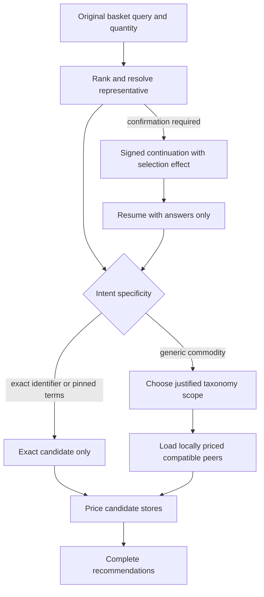
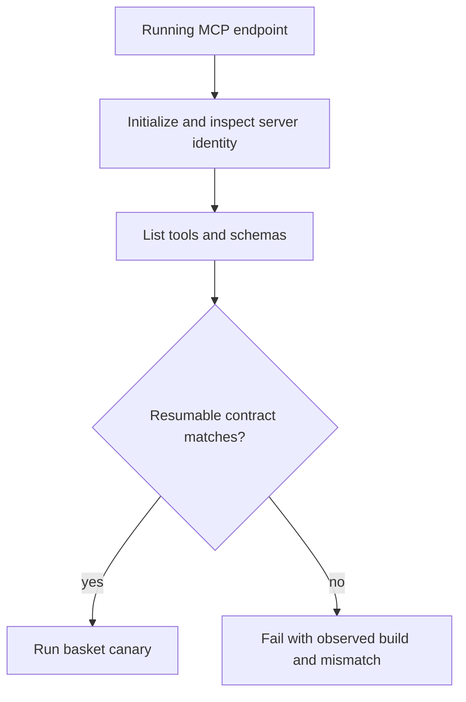

# Basket Local Commodity Coverage and Runtime Parity - Plan

## Goal Capsule

- **Objective:** Ensure generic basket lines use compatible products actually priced at each candidate branch, while exact product selections remain exact and the deployed MCP contract cannot silently lag behind the repository.
- **Product authority:** The user's original free-text query and quantity define intent; a representative SKU may determine a compatible class but must not accidentally narrow a generic category.
- **Execution profile:** Test-first fix across basket inference, end-to-end coverage, and operational contract verification.
- **Stop conditions:** No ingestion migration is required; stop and reassess if the fix would substitute across an explicit brand, variant, varietal, or exact `product_id`.
- **Tail ownership:** Implementation must include targeted review of inference safety and a live canary against the populated local database.

---

## Product Contract

### Summary

The database correctly contains fresh tahini and wine prices for Carrefour Neve Amal, but a shopping run reported those categories missing after generic intent became tied to exact SKUs without branch prices. The fix must preserve generic intent through resolution and continuation, select the cheapest compatible local product when the user has not constrained the category, and make stale MCP deployments detectable before agents follow obsolete tool instructions.

### Problem Frame

`priceStoreBasket` correctly reports `no_price_data` when an exact selected SKU has a chain listing but no price at a branch. The incorrect behavior occurs earlier: a generic query can inherit the deepest class of one representative SKU or be reconstructed as an exact `product_id`, preventing locally priced peers from participating. Separately, the connected MCP server exposed the removed `prepare_basket` workflow even though the repository registers only resumable `optimize_basket`, demonstrating runtime/repository contract drift.

### Requirements

**Generic commodity intent**

- R1. A bare generic wine query such as `יין` treats all compatible wine products as interchangeable and chooses the cheapest locally priced option, regardless of color, because the user explicitly selected cheapest-any-wine behavior.
- R2. A more specific wine query such as `יין אדום`, `יין לבן`, `קברנה`, or a named brand must retain that specificity and must not broaden to incompatible wine classes.
- R3. A generic tahini request for 500g must price compatible locally stocked 500g tahini products instead of reporting the category missing because one representative SKU lacks a branch price.
- R4. Equivalence scope must derive from user query specificity, quantity, unit, variant, and explicit brand—not solely from the representative product's deepest taxonomy class.
- R5. For commodity intent, each store must use the lowest line total among all approved compatible candidates, including when the representative is stocked; candidate limits must not discard a store's cheapest compatible option.

**Exact selections and continuation**

- R6. Direct `product_id` or GTIN requests without free text remain exact and must never silently substitute another product.
- R7. Resuming `optimize_basket` must preserve the original query and `selectionEffect`; a representative confirmation remains commodity intent, while a pin confirmation remains exact intent.
- R8. Agents must not reconstruct a confirmation response into a new initial basket containing exact product IDs.

**Runtime parity**

- R9. A deployed MCP endpoint must expose a machine-checkable basket protocol/build identity and a contract canary must fail when `prepare_basket` exists, `optimize_basket` lacks continuation fields, server metadata does not identify the resumable protocol, or the reported build differs from an independently supplied expected revision.
- R10. The basket live canary must exercise both initial and resume states and directly verify whether generic tahini and wine are priced at the configured Neve Amal branch.

### Acceptance Examples

- AE1. **Generic wine at Neve Amal**
  - **Given:** The query is `יין`, quantity is three units, the representative catalog hit is red wine, and the branch has a cheaper white or rosé wine with compatible pack size.
  - **When:** The basket is optimized.
  - **Then:** The branch may use the cheaper compatible wine; it is not restricted to the representative's `red_wine` class.
  - **Covers:** R1, R4, R5

- AE2. **Specific wine remains specific**
  - **Given:** The query is `יין אדום קברנה`, and the branch has cheaper white wine and merlot.
  - **When:** Equivalents are built.
  - **Then:** White wine and merlot are excluded because they do not satisfy the requested type/varietal.
  - **Covers:** R2, R4

- AE3. **Generic tahini uses a local peer**
  - **Given:** The selected representative is Ahva traditional tahini 500g without a Neve Amal price, while another regular 500g tahini has a current branch price.
  - **When:** The store basket is priced.
  - **Then:** The locally priced compatible tahini is included and the line is not marked `no_price_data`.
  - **Covers:** R3, R4

- AE4. **Exact SKU is not relaxed**
  - **Given:** The request contains only an exact Taster's Choice `product_id`, and another coffee is cheaper locally.
  - **When:** The basket is priced.
  - **Then:** The alternative coffee is not substituted; missing exact inventory remains explicit.
  - **Covers:** R6

- AE5. **Continuation preserves representative intent**
  - **Given:** A commodity question is answered with one offered representative SKU.
  - **When:** The signed continuation is resumed.
  - **Then:** The original query and quantity remain present and compatible chain-local peers are still eligible.
  - **Covers:** R7, R8

- AE6. **Stale server is rejected**
  - **Given:** An endpoint exposes `prepare_basket` or an old one-shot `optimize_basket` schema.
  - **When:** The MCP contract canary runs.
  - **Then:** It exits non-zero with the observed protocol/build identity and the exact contract mismatch.
  - **Covers:** R9

### Success Criteria

- The Neve Amal regression fixture prices generic 500g tahini and generic wine from branch-local rows.
- Specific wine, brand, variant, pack compatibility, and exact-SKU safety tests remain green.
- The resumable BBQ golden path completes through continuation without reconstructing items.
- The deployed-tool contract can be checked independently of repository unit tests.
- No schema migration, ingestion backfill, or product reclassification is required for the confirmed incident.

### Scope Boundaries

**In scope**

- Query-aware taxonomy depth for commodity peers.
- Preservation of representative versus exact intent.
- Full initial-to-resume regression coverage.
- MCP build/protocol identity and deployed contract smoke testing.
- Canary reporting for the affected Herzliya basket.

**Out of scope**

- Silent substitution for exact `product_id`, GTIN, brand, diet/zero, organic, varietal, or other pinned requests.
- Changes to supermarket ingestion, `store_price`, canonical GTINs, or semantic classification migrations.
- Redesigning generic product question copy beyond what is required to preserve intent.
- Automatically purchasing or placing an order.

---

## Planning Contract

### Key Technical Decisions

- KTD1. **Generic wine broadens at the wine family level.** `(session-settled: user-directed — chosen over asking for wine type or defaulting to dry red: the user wants the cheapest wine when no type is specified.)` Bare `יין` uses the `wine` family rather than the representative SKU's color-specific leaf class.
- KTD2. **Specificity selects taxonomy depth.** Use the deepest class justified by the query: broad category queries may relax the representative's leaf class; explicit color/type/varietal queries retain the deeper class and query-token gates.
- KTD3. **Exact identifiers remain hard pins.** Do not solve the incident by globally broadening `product_id` requests; continuation answers already distinguish `representative` from `pin`, and that distinction remains authoritative.
- KTD4. **Commodity pricing minimizes approved line totals.** Local alternatives are attached before pricing, and `priceStoreBasket` compares the primary and approved equivalents for commodity intent even when the primary is stocked. Exact intent retains primary-only behavior; pricing never performs an ungated fallback search.
- KTD5. **Candidate bounds cannot hide a store minimum.** Retain the cheapest compatible candidate for every in-scope store before applying diversity/fill limits; the ordinary cap is soft when more candidates are required to preserve those per-store minima.
- KTD6. **Runtime parity is verified externally.** Local registrar tests are necessary but insufficient; add a canary that compares the running MCP endpoint's tools, schema, protocol identity, and immutable build revision with an independently supplied expected revision.
- KTD7. **No ingestion work in this fix.** Direct database evidence shows current Neve Amal prices for suitable tahini and wines, so ingestion changes would address the wrong layer.

### High-Level Technical Design

The following is directional guidance, not implementation specification.

Runtime parity is checked on a separate path:

### Existing Patterns to Preserve

- `services/api/src/services/basket/intentProfile.ts` owns exact versus commodity intent.
- `services/api/src/services/basket/commodityCoverage.ts` loads priced class peers and enforces query tokens, variants, and pack compatibility before pricing.
- `services/api/src/services/basket/equivalence.ts` provides query-token and head-anchor safety gates.
- `services/api/src/services/basket/continuation.ts` preserves the original item and applies `selectionEffect`.
- `services/api/src/services/basket/priceStoreBasket.ts` prices only the resolved primary and approved equivalents; this plan changes primary preference only for commodity intent.
- `services/api/src/mcp/tools/basket/index.ts` defines the resumable MCP boundary and forbids mixed initial/resume forms.

### Sequencing

1. Lock the affected generic/specific inference behavior with focused failing tests.
2. Implement query-aware equivalence scope without weakening exact or variant guards.
3. Add an end-to-end initial/resume/store-pricing regression using branch-local alternatives.
4. Add deployed MCP contract identity and smoke verification.
5. Extend the live canary and rerun focused, package, and repository checks.

### Risks and Mitigations

- **Over-broad substitution:** Broad `יין` could admit cooking wine or non-wine alcohol. Mitigate with taxonomy `class_l2=wine`, head anchoring, normal variant constraints, positive price, and pack compatibility.
- **Specificity loss:** Relaxing class depth could turn red wine into white for `יין אדום`. Mitigate with explicit tests for color, varietal, and brand tokens before changing production logic.
- **Regression to coffee/cola substitutions:** Shared commodity infrastructure also protects Taster's Choice and Coke Zero. Retain exact and variant regression tests and avoid changes in `priceStoreBasket` fallback eligibility.
- **Bounded candidate correctness:** A fixed global peer cap can discard the cheapest product in a large wine class. Retain each store's cheapest approved candidate before optional diversity fill and add a fixture exceeding the current cap.
- **Canary brittleness:** A deployed contract check tied to full JSON ordering would fail harmless releases. Assert semantic fields and prohibited/required tools rather than byte-for-byte schemas.
- **Environment ambiguity:** Build metadata may be absent in local development. Use a deterministic development fallback, but require deployed environments to publish a revision and require the contract canary to compare it with an independently supplied expected revision.

---

## Implementation Units

### U1. Query-aware commodity equivalence scope

- **Goal:** Make the user's query determine how deeply taxonomy constrains equivalent products.
- **Requirements:** R1, R2, R3, R4, R5; KTD1, KTD2, KTD4, KTD5
- **Files:**
  - `services/api/src/services/basket/commodityCoverage.ts`
  - `services/api/src/services/basket/equivalence.ts`
  - `services/api/src/services/basket/intentProfile.ts`
  - `services/api/src/services/basket/rankQueryCandidates.ts`
  - `services/api/src/services/basket/priceStoreBasket.ts`
  - `services/api/tests/services/basket/commodityCoverage.test.ts`
  - `services/api/tests/services/basket/equivalence.test.ts`
  - `services/api/tests/services/basket/herzliyaGolden.test.ts`
  - `services/api/tests/services/basket/priceStoreBasket.test.ts`
- **Approach:** Introduce one shared decision for the deepest taxonomy level justified by the normalized query. Bare category queries use a broader stable class such as `alcohol/wine`; color/type queries use the matching leaf; brand and varietal tokens continue through existing token gates. Replace the current bare-alcohol exclusion for `יין` with this settled cheapest-any-wine behavior while preserving explicit-type and non-wine alcohol safety. Apply the scope decision both when in-memory equivalents are built and when priced class peers are fetched. Retain every store's cheapest approved candidate before optional cap/diversity fill, and make commodity pricing choose the lowest line total while exact pricing continues to prefer only the pinned product.
- **Test Scenarios:**
  - Bare `יין` auto-resolves without a wine-type confirmation, includes compatible red, white, and rosé 750ml candidates, and chooses the cheapest.
  - `יין אדום` excludes white and rosé candidates.
  - `יין אדום קברנה` excludes merlot despite sharing the red-wine class.
  - `טחינה` with 500g intent includes a different regular 500g tahini product priced at the target branch.
  - Organic or otherwise non-regular tahini does not join a regular line.
  - A 2L wine and an incompatible unit remain excluded.
  - A stocked representative loses to a cheaper approved equivalent for commodity intent.
  - The same stocked representative remains mandatory for exact intent.
  - With more than 20 compatible wines, each store's cheapest candidate survives peer limiting.
- **Verification:** Focused basket equivalence, commodity coverage, and Herzliya golden tests pass.

### U2. Continuation and exact-intent regression hardening

- **Goal:** Prove representative confirmations preserve commodity breadth while exact answers remain pinned.
- **Requirements:** R6, R7, R8; KTD3
- **Files:**
  - `services/api/tests/services/basket/continuation.test.ts`
  - `services/api/tests/services/basket/questionAvailability.test.ts`
  - `services/api/tests/services/basket/productIdCoverage.test.ts`
- **Approach:** Keep the existing signed-token and answer validation design unchanged unless a new regression test exposes a defect. Strengthen tests around the transition from `selectionEffect=representative` to `intentModeOverride=commodity`, including original query/quantity preservation. Add symmetric assertions for `pin`, product-ID-only, and GTIN-only calls so future fixes cannot broaden exact lines.
- **Test Scenarios:**
  - Representative answer retains query, amount/unit, selected representative, and commodity override.
  - Pin answer retains query and quantity but produces exact override.
  - Mixed initial fields with continuation remain rejected.
  - Unknown, duplicate, missing, or unoffered answers remain rejected.
  - Product-ID-only Taster's Choice and Coke Zero do not gain class peers.
  - A GTIN-only request does not gain class peers or substitute another product.
- **Verification:** Continuation, question availability, and product-ID coverage tests pass without changing the public resume shape.

### U3. Full Neve Amal regression through final pricing

- **Goal:** Reproduce the incident across resolution, continuation, equivalence, and branch pricing rather than testing those layers only in isolation.
- **Requirements:** R1, R3, R5, R6, R7, R8, R10
- **Files:**
  - `services/api/tests/services/basket/resumableBbqGolden.test.ts`
  - `services/api/tests/services/basket/optimizePricingScope.test.ts`
  - `services/api/tests/services/basket/optimizeCompleteness.test.ts`
  - `services/api/src/scripts/canaryBasket.ts`
- **Approach:** Add deterministic fixtures for both failure modes: an unpriced representative with a priced peer, and a stocked representative with a cheaper priced peer. Exercise an initial request, answer every required question using the returned continuation, and assert final store lines. Extend the live canary with an opt-in safe auto-resume mode that selects offered locally priced options without ordering anything, requests all verbose store results, locates a configured stable Neve Amal store ID, and fails if that branch is absent or lacks final tahini/wine lines.
- **Test Scenarios:**
  - Target store includes generic tahini via a local peer and does not report `no_price_data`.
  - Target store includes the cheapest compatible generic wine even when its color differs from the representative.
  - Target store chooses a cheaper approved wine even when the representative also has a branch price.
  - An exact SKU lacking a branch price remains missing with `no_price_data`.
  - Resume uses only continuation and answers; reconstructed items are absent.
  - Final recommendations and multi-store totals count every priced line exactly once.
  - Canary initial and resumed phases expose question count, selection effects, chosen answers, final coverage, and freshness for the configured Neve Amal store ID.
- **Verification:** The targeted resumable BBQ regression passes, then the live local-database canary confirms tahini and wine coverage at the Neve Amal branch.

### U4. Deployed MCP contract and build parity

- **Goal:** Detect an old MCP process before an agent follows obsolete basket instructions.
- **Requirements:** R9; KTD6
- **Files:**
  - `services/api/src/mcp/server.ts`
  - `services/api/src/mcp/tools/basket/index.ts`
  - `services/api/src/scripts/canaryMcpContract.ts`
  - `services/api/tests/mcp/tools/index.test.ts`
  - `services/api/package.json`
  - `.env.example`
  - `docs/HOW-IT-WORKS.md`
- **Approach:** Publish a basket protocol identifier and immutable CI-injected commit or release digest in server metadata or instructions using a deterministic development fallback. Add a script that initializes the configured MCP endpoint, inspects tool names and the `optimize_basket` schema, and compares the reported digest with a separately supplied expected digest. Fail on legacy `prepare_basket`, missing continuation/answers, deprecated quantity fields, unexpected protocol identity, absent deployed revision, or revision mismatch. Document restart/redeploy and post-deploy verification as one operational gate.
- **Test Scenarios:**
  - Local registration exposes only resumable `optimize_basket`.
  - Contract canary accepts the current schema and protocol identity.
  - Contract canary rejects an endpoint exposing `prepare_basket`.
  - Contract canary rejects `optimize_basket` without continuation/answers or with deprecated `qty`.
  - Missing build revision uses the deterministic fallback in development and causes the contract canary to fail in deployed environments.
  - A nonempty but stale build revision fails comparison with the independently supplied expected revision.
- **Verification:** MCP registrar tests pass and the contract canary reports the running server's expected build and resumable protocol.

---

## Verification Contract

| Gate | Scope | Done signal |
|---|---|---|
| Focused inference tests | Commodity coverage, equivalence, wine specificity, tahini compatibility | All targeted Vitest files pass |
| Protocol tests | Continuation, question effects, MCP dual-form validation | Representative and pin behavior pass; legacy surface absent |
| Golden regression | Initial request through resumed final pricing | Neve Amal prices generic tahini and wine from local peers |
| API package tests | All API behavior | `pnpm --filter @super-mcp/api test` passes |
| Type safety | Workspace TypeScript | `pnpm typecheck` passes |
| Live database canary | Populated local DB | Initial/resume flow completes and verifies tahini/wine coverage at the configured Neve Amal store ID |
| Deployed MCP contract | Running endpoint | Reported revision matches the independently supplied expected revision; no `prepare_basket`; resumable schema present |

No ingestion fixture or migration gate is required unless implementation evidence contradicts the verified database state.

---

## Definition of Done

- R1–R10 are covered by automated tests or an explicit operational verification.
- Generic `יין` chooses the cheapest compatible wine family member; specific wine queries preserve their constraints.
- Generic 500g tahini can use a suitable Neve Amal product even when the representative SKU lacks a branch price.
- Exact product identifiers and pinned confirmations never silently broaden.
- The full resumable path is tested without callers reconstructing basket items.
- The running MCP endpoint exposes its protocol/build identity and passes the external contract canary after restart or deployment.
- Focused tests, API tests, workspace typecheck, live basket canary, and MCP contract canary pass.
- Documentation explains the deployed contract check and the distinction between representative and exact confirmation.
- No ingestion migration, speculative data cleanup, abandoned experiment, or unrelated refactor remains in the implementation diff.

---

## Appendix

### Grounding Evidence

- Direct database inspection on 2026-07-20 found 11 priced 500g tahini products and 37 priced 750ml red-wine-class products at Carrefour Neve Amal, with source timestamps from 2026-07-18.
- The two manually selected SKUs had Carrefour chain listings but no `store_price` row for that branch, which correctly triggered `no_price_data`.
- The local canary already uses the resumable optimizer and returns `selectionEffect`; the connected MCP catalog exposed the removed prepare-first workflow, confirming runtime drift.
- `docs/superpowers/plans/2026-07-20-resumable-basket-optimization.md` defines the original resumable protocol and intent-preservation architecture.
